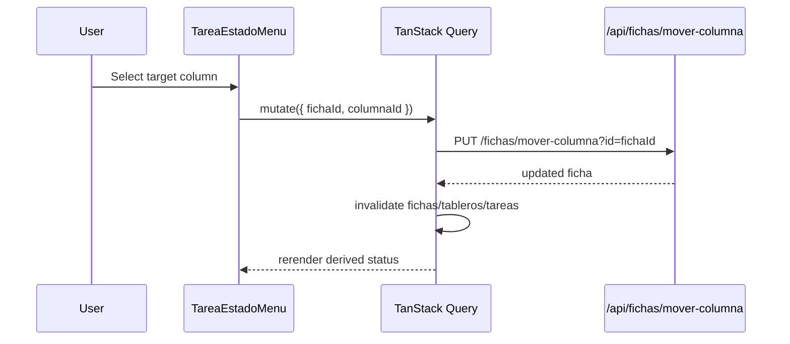

# Design: Kanban Workflow State Source

## Decision

- Tareas: operational status is derived from the `TAREA` ficha's current column.
- Tratos: pipeline stage is derived from the `TRATO` ficha's current column.
- `Trato.estado` remains commercial outcome and is changed only by explicit win/loss actions.
- `localStorage` task status is removed as source of truth.

## Derived Workflow Model

Create selectors/helpers that join:

- entities: `Tarea[]` or `Trato[]`
- fichas: `Ficha[]`
- tablero columns: `ColumnaTablero[]`

Output for tasks:

```ts
interface TareaWorkflowState {
  tareaId: string;
  fichaId: string | null;
  columnaId: string | null;
  nombre: string;
  color: string | null;
}
```

Fallback label: `Sin columna`.

## UI Flow: Change Task Status



## Query Strategy

- Reuse `useFichas({ tipoFicha: 'TAREA', tareaIds })` for task status derivation.
- Reuse tableros queries to obtain TAREAS columns.
- `useMoverFicha` remains the mutation for moving cards.
- Invalidate fichas after move; existing hook already does optimistic update and invalidation if present.

## UX Language

- Tareas: label can remain `Estado` if it means operational column.
- Tratos: use `Etapa` for Kanban column and `Resultado`/`Estado comercial` for `Trato.estado` to avoid confusion.

## Tests

- Pure selector tests for resolving task workflow state.
- Component tests for badge/menu no longer touching localStorage.
- Existing Kanban move tests should continue to prove drag/drop only moves fichas.
